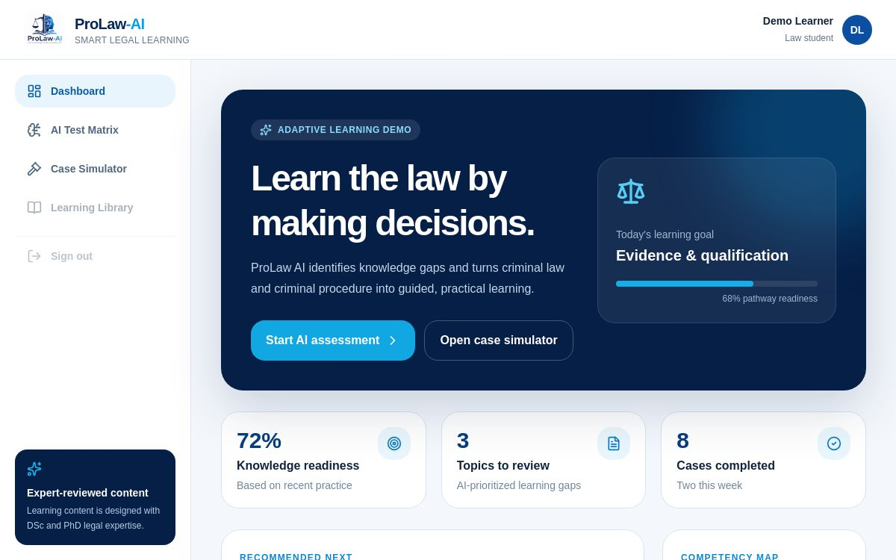

# ProLaw AI

ProLaw AI is an English-language MVP of an AI-powered adaptive legal learning and case-simulation platform. It helps law students and legal professionals identify knowledge gaps and practise decisions in criminal law and criminal procedure.

## Live demo

**[Open the ProLaw AI MVP](https://prolaw-ai.allambergen1k.chatgpt.site)**



## MVP features

- Adaptive three-question legal assessment
- Topic-level knowledge-gap analysis
- Personalized learning recommendations
- Three-stage interactive investigation case
- Immediate expert-guided decision feedback
- Responsive dashboard for desktop and mobile
- Educational-use disclaimer

## Technology

- Next.js 16 and React 19
- TypeScript
- Tailwind CSS
- Lucide icons
- Cloudflare-compatible Vinext build

## Run locally

```bash
pnpm install
pnpm dev
```

Then open the local URL shown in the terminal.

## Build

```bash
pnpm build
```

## Project team

- Bauirjan Ermekbayev — CEO / Founder
- Miratdiyin Najimov — CSO / Co-Founder
- Allambergen Kalbayev — CTO

## Important notice

This prototype is designed for education. It does not provide legal advice and does not replace official legislation or professional legal review. Demo cases are simplified and must be expert-verified before production use.

## License

Copyright © 2026 ProLaw AI team. All rights reserved.
